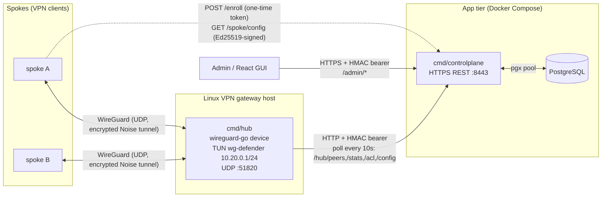
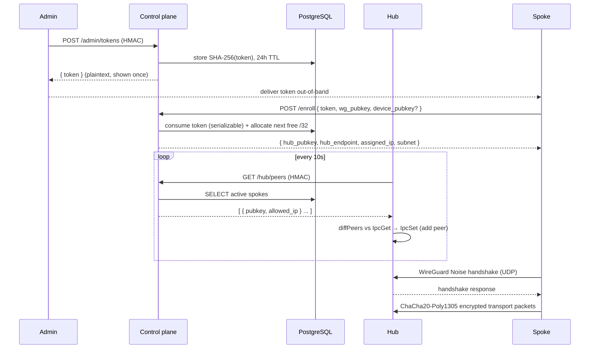
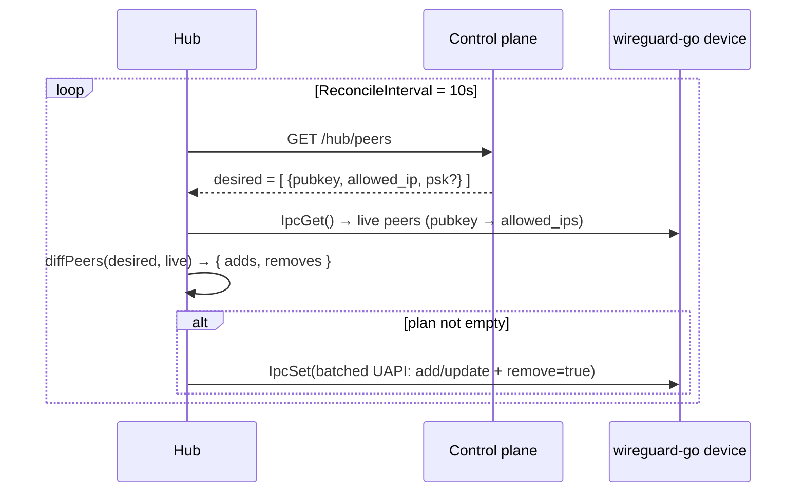
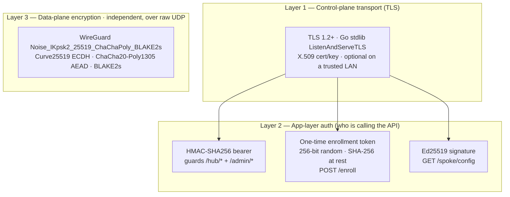
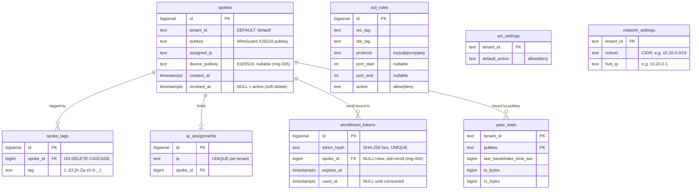
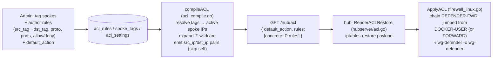

# Defender Server — Architecture (Hub + Control Plane)

> **Scope:** the **server** side of Defender V0 only — the two Go binaries in this repo
> (`cmd/hub` and `cmd/controlplane`) and their shared packages. For the cross-component
> contract (spoke client, GUI, the full product), see the central
> `defender/docs/ARCHITECTURE.md`. This document is self-contained and focuses on how the hub
> and the control plane communicate, what the server can do today, every endpoint, and — in
> depth — **what encryption is used and how it actually happens**.

---

## 1. Overview & the two-process model

Defender is a hub-and-spoke WireGuard VPN. The server is **two independently-deployed
processes** that share exactly two things: one **PostgreSQL** database and one **HMAC secret**.

| Process | Binary | Role | Where it runs |
|---|---|---|---|
| **Control plane** | `cmd/controlplane` | HTTPS REST "brain": enrollment, peer/stats feed, admin + ACL + network APIs. Backed by Postgres. | App tier (Docker Compose) |
| **Hub** | `cmd/hub` | Stateless WireGuard concentrator / data plane. One `wireguard-go` device; every spoke is one peer. | Linux VPN gateway host (separate) |

The defining invariant:

> **The hub holds no desired state.** It polls the control plane on fixed 10-second loops and
> converges the *live* WireGuard device (`IpcGet` → diff → `IpcSet`) onto whatever the database
> says. The control plane never calls the hub — there is **no CP→hub RPC**. Every behavior change
> is a DB/handler change on the control-plane side, picked up by the hub within ~10s.



The hub is **not** in the app-tier Compose stack — it's a privileged Linux appliance behind the
`hub` Compose profile, deployed on the gateway host (see `docs/INSTALL.md`, Path B).

---

## 2. Current capabilities & features

Everything below is **shipped and working today** on `feat/admin-ip-management`. In particular,
**admin management is live end-to-end across both the server and the client.**

- **Spoke enrollment** via single-use, time-limited tokens → **stable, identity-bound IPs**
  (a spoke keeps its `10.20.0.x` across key rotations; identity is the durable `spoke.id`).
- **Admin management — LIVE in server + client:**
  - Issue enrollment tokens (`POST /admin/tokens`).
  - List spokes with live online status + transfer stats (`GET /admin/spokes`).
  - Revoke a spoke (`DELETE /admin/spokes/{id}`).
  - **Re-roll** a spoke's WireGuard key, keeping its ID + IP (`POST /admin/spokes/{id}/reroll`).
  - **Edit** a spoke's assigned IP (`PUT /admin/spokes/{id}/ip`).
  - **Edit the overlay network** (subnet + hub IP) at runtime (`PUT /admin/network`).
  - **Tag** spokes and manage **ACL** policy + rules (tag-based microsegmentation).
- **Signed spoke config auto-refresh:** an enrolled spoke polls `GET /spoke/config` (authenticated
  by an Ed25519 device-key signature) to pick up admin-driven IP/subnet/hub changes **without
  re-enrolling**.
- **Tag-based ACL** compiled to a concrete per-hub iptables feed; enforced for spoke-to-spoke
  traffic, rebuilt atomically every 10s.
- **Live network re-addressing:** changing the subnet/hub IP re-addresses the hub's TUN interface
  in place (no restart).
- **Hub data plane:** four concurrent reconcile/stats/acl/config loops; spoke-to-spoke routing via
  IP forwarding + an iptables hairpin.

**Single-tenant today.** Every table carries an unused `tenant_id DEFAULT 'default'` seam so
multi-tenant can be enabled later without a destructive migration.

---

## 3. Communication & data transport

There are **two transports** in the system, with very different trust models:

1. **Hub ⇄ Control plane** — HTTP(S), JSON, authenticated by an HMAC bearer token.
2. **Spoke ⇄ Hub** — WireGuard over UDP, encrypted by the Noise protocol (§4c).

### 3.1 Hub → Control plane (the polling client)

`pkg/hubserver/client.go` is a thin JSON-over-HTTP client. It derives the bearer token once
(`deriveBearer`, identical to the server's `expectedBearer`) and sets
`Authorization: Bearer <hex>` on every request via `authorize()`. The underlying `http.Client`
has a **15s timeout** and uses **standard TLS verification** (no skip-verify).

| Client method | Call | Purpose |
|---|---|---|
| `FetchPeers` | `GET /hub/peers` | desired peer set (pubkey, allowed_ip, psk?) |
| `PostStats` | `POST /hub/stats` | push per-peer handshake + byte counters |
| `FetchACL` | `GET /hub/acl` | compiled ACL (concrete src/dst IP rules) |
| `FetchConfig` | `GET /hub/config` | overlay TUN address (e.g. `10.20.0.1/24`) |

### 3.2 The four hub loops (all 10s) + startup fetch

| Loop | File | Interval | What it does |
|---|---|---|---|
| Startup TUN fetch | `cmd/hub/main.go` `fetchTUNAddress` | 15s timeout (once) | get TUN CIDR before bring-up; fail fast on bad value |
| Reconcile | `pkg/hubserver/reconcile.go` | `ReconcileInterval = 10s` | `GET /hub/peers` → `diffPeers` vs `IpcGet` → batched `IpcSet` |
| Stats | `pkg/hubserver/stats.go` | `StatsInterval = 10s` | `IpcGet` counters → `POST /hub/stats` |
| ACL | `pkg/hubserver/acl.go` | `ACLInterval = 10s` | `GET /hub/acl` → render `iptables-restore` → apply |
| Hub config | `pkg/hubserver/hubconfig.go` | `HubConfigInterval = 10s` | `GET /hub/config` → re-address TUN if changed |

All four run concurrently (`go ...` in `cmd/hub/main.go`); every transient error is logged and
**non-fatal** — the loops keep running.

### 3.3 Spoke ⇄ Hub (the WireGuard data plane)

- **Transport:** UDP, hub listens on `:51820`. Pure star topology — no inter-spoke peering; spokes
  reach each other *through* the hub.
- **Interface:** TUN `wg-defender`, MTU **1420**, hub address `10.20.0.1/24`.
- **Addressing:** each spoke is one WireGuard peer with a single `/32` `allowed_ip`
  (e.g. `10.20.0.2/32`).
- **Keepalive:** owned by **spokes** (persistent keepalive ~25s). The hub sets `keepalive=0` for
  peers — it never initiates.
- **The UAPI seam:** the hub never hand-rolls crypto. `pkg/wgconfig/config.go` builds the
  `key=value` UAPI strings (`private_key`, `listen_port`, `public_key`, `allowed_ip`,
  `preshared_key`, `endpoint`, `persistent_keepalive_interval`, `remove`) that drive `wireguard-go`
  via `IpcSet`/`IpcGet`.

**Enrollment → first encrypted packet:**



**The reconcile loop in detail:**



`diffPeers` is a **pure function** (unit-tested without a device): a peer is *added/updated* if it's
missing from the live set **or** its allowed-IP set differs (so a re-IP is applied); a peer is
*removed* if it's live but no longer desired. All changes go out in **one batched `IpcSet`**.

---

## 4. Encryption — what is used, and how it actually happens

The server has **three independent cryptographic layers**, each with its own primitives and its own
job. Don't conflate them: TLS protects the *control-plane transport*, the auth tokens prove
*who is calling the API*, and WireGuard's Noise protocol encrypts the *actual VPN traffic*.



### 4a. Layer 1 — Control-plane transport (TLS)

The control plane serves HTTPS via Go's standard `http.Server.ListenAndServeTLS`
(`pkg/controlplane/server.go:440`), loading the cert/key from `DEFENDER_TLS_CERT` /
`DEFENDER_TLS_KEY`. This protects the HMAC bearer token and all JSON in transit.

`DEFENDER_TLS_DISABLE=1` switches to plain HTTP (`ListenAndServe`) for trusted LAN / local dev only.
The control plane logs a loud warning because **the HMAC bearer token then travels in cleartext**.
The hub's own client uses standard TLS verification when `DEFENDER_CP_URL` is `https://`.

### 4b. Layer 2 — App-layer authentication (three schemes)

Authentication is decoupled from transport: even over TLS, every privileged call must prove itself.

**HMAC-SHA256 bearer** — `pkg/controlplane/auth.go`. Guards **all `/hub/*` and `/admin/*`** routes.
The token is *not* the secret; it is a fixed-message MAC:

```
token = hex( HMAC-SHA256( DEFENDER_HMAC_SECRET, "defender-control-plane-v0" ) )
```

`expectedBearer` computes the expected value; `requireAuth` extracts `Authorization: Bearer <token>`
and compares with **`crypto/subtle.ConstantTimeCompare`** (timing-attack resistant), returning a
bare `401` on mismatch. The hub derives the identical token from the **shared** secret — so the
secret itself never crosses the wire, only its MAC.

**One-time enrollment tokens** — `pkg/controlplane/server.go`. `POST /enroll` is *not* behind the
bearer wrapper; its credential is a single-use token in the body:

- `generateToken` → **256 bits** from `crypto/rand`, hex-encoded.
- Only the **SHA-256 hash** (`hashToken`) is ever persisted — never the plaintext.
- Consumed exactly once: the store marks `used_at` under a `FOR UPDATE` row lock inside a
  **serializable** transaction, so concurrent enrollments can't reuse or race a token.
- TTL: **24h** for new enrollments, **15m** for re-roll tokens (key rotation is more sensitive).

**Ed25519 signed spoke-config** — `pkg/controlplane/spoke_config.go`. `GET /spoke/config`
authenticates by a signature, not a bearer. The spoke signs, with its **device** private key:

```
message = "defender-spoke-config-v1" \n <wg-pubkey-base64> \n <unix-timestamp>
```

passed via `X-Defender-Pubkey` / `X-Defender-Timestamp` / `X-Defender-Signature` headers. The server
verifies with `ed25519.Verify` against the `device_pubkey` it stored at enrollment, rejecting any
request outside a **±5-minute** clock-skew window (replay protection). Every failure returns an
indistinguishable `401`.

> **Why a separate Ed25519 key?** WireGuard keys are **X25519** (Diffie-Hellman) — they do key
> agreement, not signatures. To let a spoke *sign* a config poll, enrollment optionally registers a
> dedicated Ed25519 device key alongside the WireGuard key.

### 4c. Layer 3 — Data-plane encryption (WireGuard / Noise)

The actual VPN traffic between spokes and the hub is encrypted by **WireGuard**, implemented by the
vendored, pinned `third_party/wireguard-go` submodule and driven **only via UAPI** — the server
writes **no custom crypto**. The construction
(`third_party/wireguard-go/device/noise-protocol.go:50`) is:

```
Noise_IKpsk2_25519_ChaChaPoly_BLAKE2s
```

How a tunnel is established and used:

- **Handshake — Noise `IKpsk2`, 1-RTT.** The initiator already knows the responder's static public
  key (`IK`); `psk2` allows an optional pre-shared key mixed in at the second position. Message
  types: `1` initiation, `2` response, `3` cookie reply (rate-limit/DoS defense), `4` transport.
- **Key agreement — Curve25519 (X25519) ECDH.** Ephemeral + static Diffie-Hellman gives forward
  secrecy; each side mixes the shared secrets into a running chaining key.
- **KDF + transcript hash — BLAKE2s.** HKDF-style `KDF1/2/3` derive keys; a rolling BLAKE2s hash
  binds the whole handshake transcript (authenticates identities + prevents tampering).
- **Optional PSK.** When present, a 32-byte pre-shared key is folded into the chaining key via
  `KDF3` at psk2 — adds a post-quantum-ish symmetric hedge on top of the ECDH.
- **Transport encryption — ChaCha20-Poly1305 (AEAD).** Every data packet is sealed with a 256-bit
  session key and a 64-bit counter nonce; Poly1305 gives a 16-byte authentication tag. A
  per-session **replay filter** rejects repeated/old counters.
- **Rekey / rotation.** Sessions rotate to fresh keypairs periodically; the previous keypair is kept
  briefly to decrypt in-flight packets, so rotation is seamless.

**Pre-shared key (PSK) — current status (honest):** the PSK is **plumbed end-to-end but not yet
used in V0.** The DTOs (`enrollResponse.PSK`, `hubPeerDTO.PSK`), the `DesiredPeer.PSK` field, and
`wgconfig` (`preshared_key=<hex>`) all carry it, so wiring a PSK requires no new transport. But the
database has **no PSK column** and `store.ActivePeers` returns an **empty** PSK — so today every
peer is configured without one. The handshake therefore runs `IKpsk2` with an all-zero PSK
(equivalent to plain `IK`).

### Encryption summary

| Layer | Where | Primitive(s) | Protects |
|---|---|---|---|
| Transport | `server.go` (TLS) | TLS 1.2+, X.509 | control-plane HTTP in transit (optional) |
| Auth: hub/admin | `auth.go` | HMAC-SHA256 + constant-time compare | who may call `/hub/*`, `/admin/*` |
| Auth: enroll | `server.go` | `crypto/rand` 256-bit, SHA-256 at rest | single-use enrollment |
| Auth: spoke poll | `spoke_config.go` | Ed25519 signature, ±5m skew | who may read `/spoke/config` |
| Data plane | `wireguard-go` (UAPI) | Curve25519 · ChaCha20-Poly1305 · BLAKE2s · (opt) PSK | the VPN traffic itself |

---

## 5. Endpoint reference (complete & current)

All routes are wired in one place: `pkg/controlplane/server.go` `Routes()`. Three trust tiers.

### Spoke-facing

| Method & path | Auth | Request | Response | Handler |
|---|---|---|---|---|
| `POST /enroll` | one-time token (body) | `{ token, pubkey, assigned_ip?, device_pubkey? }` | `{ hub_pubkey, hub_endpoint, assigned_ip, subnet, psk?, trust_overlay }` | `server.go` `handleEnroll` |
| `GET /spoke/config` | Ed25519 signature (headers) | — (signed headers) | `{ assigned_ip, subnet, hub_endpoint, hub_pubkey }` | `spoke_config.go` |

### Hub-facing (HMAC bearer)

| Method & path | Request | Response | Handler |
|---|---|---|---|
| `GET /hub/peers` | — | `[ { pubkey, allowed_ip, psk? } ]` | `server.go` `handleHubPeers` |
| `POST /hub/stats` | `[ { pubkey, last_handshake_time_sec, tx_bytes, rx_bytes } ]` | `204` | `server.go` `handleHubStats` |
| `GET /hub/acl` | — | `{ default_action, rules:[ {src_ip,dst_ip,protocol,port_start?,port_end?,action} ] }` | `acl_compile.go` |
| `GET /hub/config` | — | `{ tun_address }` (e.g. `10.20.0.1/24`) | `network.go` `handleHubConfig` |

### Admin / GUI-facing (HMAC bearer)

| Method & path | Request | Response | Handler |
|---|---|---|---|
| `POST /admin/tokens` | — | `{ token }` (shown once) | `server.go` `handleCreateToken` |
| `GET /admin/spokes` | — | `[ { id, pubkey, assigned_ip, last_handshake_time_sec, tx_bytes, rx_bytes, online, tags[] } ]` | `server.go` `handleListSpokes` |
| `DELETE /admin/spokes/{id}` | — | `204` | `server.go` `handleRevokeSpoke` |
| `POST /admin/spokes/{id}/reroll` | — | `{ token }` (reroll token, 15m TTL) | `admin_ip.go` `handleRerollSpoke` |
| `PUT /admin/spokes/{id}/ip` | `{ assigned_ip }` | `{ id, pubkey, assigned_ip }` | `admin_ip.go` `handleSetSpokeIP` |
| `GET /admin/network` | — | `{ subnet, hub_ip }` | `network.go` `handleGetNetwork` |
| `PUT /admin/network` | `{ subnet, hub_ip, force? }` | `{ subnet, hub_ip }` | `network.go` `handlePutNetwork` |
| `GET /admin/acl/policy` | — | `{ default_action }` | `acl.go` `handleGetACLPolicy` |
| `PUT /admin/acl/policy` | `{ default_action }` | `{ default_action }` | `acl.go` `handlePutACLPolicy` |
| `GET /admin/acl/rules` | — | `[ { id, src_tag, dst_tag, protocol, port_start?, port_end?, action, description } ]` | `acl.go` `handleListACLRules` |
| `POST /admin/acl/rules` | `{ src_tag, dst_tag, protocol, port_start?, port_end?, action, description }` | created rule (with `id`) | `acl.go` `handleCreateACLRule` |
| `DELETE /admin/acl/rules/{id}` | — | `204` | `acl.go` `handleDeleteACLRule` |
| `POST /admin/spokes/{id}/tags` | `{ tag }` | `{ tags[] }` | `acl.go` `handleAddSpokeTag` |
| `DELETE /admin/spokes/{id}/tags/{tag}` | — | `204` | `acl.go` `handleRemoveSpokeTag` |

**Common status codes:** `400` invalid body/params, `401` auth failure, `404` spoke/rule not found,
`409` conflict (IP in use, pubkey in use, or active-spokes guard on network change), `500` internal.
Everything is wrapped in `withCORS` so the React GUI on another origin can call it.

---

## 6. Data model & store



Store highlights (`pkg/store/`):

- **Soft revoke + partial uniqueness.** Revocation sets `revoked_at`; "active" is everywhere
  `WHERE revoked_at IS NULL`. Partial unique indexes scope `(tenant_id, pubkey)` and
  `(tenant_id, assigned_ip)` to active rows, so a revoked spoke's key/IP can be reused.
- **Serializable mutations.** `Enroll` and `UpdateSpokeIP` run at serializable isolation so
  concurrent callers can't pick the same IP.
- **Stable identity.** `Enroll` with a reroll-bound token rotates `pubkey` (+`device_pubkey`) while
  keeping the durable `id` and `assigned_ip`; old stats keyed by the previous pubkey are dropped.
- **IP allocation.** `nextFreeIP` (pure, unit-tested) walks the subnet from `hub.Next()` and skips
  reserved addresses: the **hub IP**, the **network** address, and the **broadcast**/last host.
- **DB-authoritative network config (seed-then-obey).** `store.New` seeds `network_settings` from
  env on first start (`ON CONFLICT DO NOTHING`), then loads the persisted row as the in-memory
  authority — so an admin's earlier subnet edit survives a control-plane restart. `Subnet()`/`Hub()`
  are `RWMutex`-guarded reads; `SetNetworkConfig` guards against changing the network while active
  spokes exist unless `force=true` (`ErrActiveSpokes`).

Sentinel errors: `ErrTokenInvalid`, `ErrSpokeNotFound`, `ErrIPConflict`, `ErrIPExhausted`,
`ErrPubKeyInUse`, `ErrActiveSpokes`.

---

## 7. ACL pipeline (control plane → hub)

Microsegmentation is **tag-based** and compiled centrally, then enforced concretely on the hub.



Key properties:

- Rules are **directed** (`src_tag → dst_tag`) over `tcp/udp/icmp/any` with an optional port/range
  and an `allow`/`deny` action; an unmatched flow falls to `default_action`.
- The compiler resolves each tag to the current active spokes' IPs (the `*` wildcard = all active
  spokes), emits one concrete rule per `(src_ip, dst_ip)` pair, and skips self-pairs.
- The hub rebuilds the dedicated **`DEFENDER-FWD`** chain **atomically every 10s** via
  `iptables-restore --noflush` (other chains untouched), with a stateful
  `conntrack ESTABLISHED,RELATED → ACCEPT` rule first so replies bypass per-rule checks.
- The jump is installed **only for spoke-to-spoke** traffic (`-i wg-defender -o wg-defender`),
  preferring the `DOCKER-USER` chain and falling back to `FORWARD` on bare metal. On non-Linux,
  `ApplyACL` is a no-op. Before the first successful apply the chain is absent → **fail-open**;
  after that it's never empty.

---

## 8. Deployment & operational notes

- **App tier** (`docker-compose.yml`, `Taskfile.yml`): `postgres` → `migrate` (one-shot) →
  `controlplane` on `:8443`. Bring up with `task up`. Migrations in `migrations/` via
  `golang-migrate`.
- **Hub** is deployed separately on the Linux gateway host (`hub` Compose profile / `task hub`):
  needs `NET_ADMIN`, `/dev/net/tun`, and host networking (binds `:51820` directly). Same
  `DEFENDER_HMAC_SECRET` as the control plane; reaches it via `DEFENDER_CP_URL`.
- **Bootstrap/secrets:** `task bootstrap` generates the HMAC secret, hub keypair, and a dev TLS
  cert; `task setup` does first-host prep (submodule + secrets + `.env` + host networking).
- **wireguard-go** is a pinned git **submodule** (`third_party/wireguard-go`, tag `0.0.20250522`),
  resolved via a local `replace` — run `task submodule` (or `git submodule update --init`) after
  cloning.

**See also:** `docs/INSTALL.md` (full walkthrough + hub host deploy), `docs/SETUP.md`,
`docs/SPOKE-TO-SPOKE.md`, and the central `defender/docs/ARCHITECTURE.md` (§4.3 REST, §7 UAPI) for
cross-component detail.
